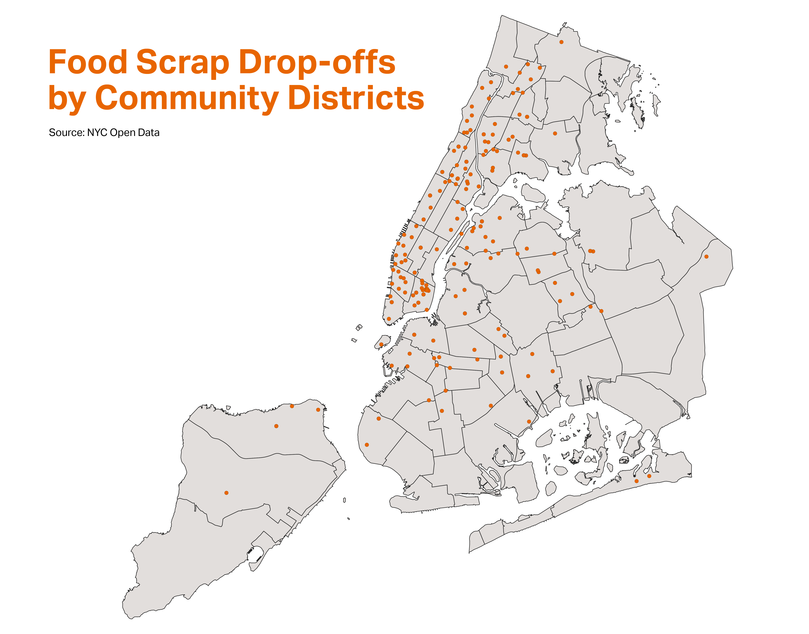

# Data Library
Curation of waste related datasets.

+ **[Food Scrap Drop-Off Locations in NYC](https://data.cityofnewyork.us/Environment/Food-Scrap-Drop-Off-Locations-in-NYC/if26-z6xq)**: DSNY maintained dataset of food drop-off sites. Includes lat/longs, community district numbers, and census tract info. 
+ **[Geographical data](https://www1.nyc.gov/site/planning/data-maps/open-data/districts-download-metadata.page)**: contains shapefiles and geojson for all kinds of political and administrative districts. 

A very quick map produced from the datasets above (easy to imagine how it may be made more interesting with added context, annotations, additional datasets, etc.): 

Ways to continue to improve this map and the related datasets:

* Add in elected officials to the geographic dataset, export as geojson
* Add column to capture status (open / closed) to Food Scrap Drop-offs dataset (especially given new conditions post-COVID)
* Annotate the map with relevant council members, interactive version could do this by tooltip. 